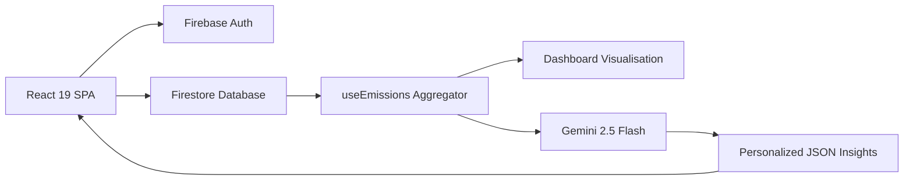

# 🌱 TerraTrace — Carbon Footprint Tracking & Reduction Platform

[](https://github.com/Yuvaakhil18/TerraTrace-Promptwars/actions/workflows/ci.yml)
[](https://www.typescriptlang.org/)
[](https://react.dev/)
[](https://tailwindcss.com/)
[](https://vitest.dev/)
[](https://firebase.google.com/)

> **PromptWars Virtual | Challenge 3 | Hack2Skill × Google for Developers**
> A web application that helps individuals **understand, track, and reduce** their personal carbon footprint through simple inputs and **personalized, AI-generated insights**.

**Live Demo:** [https://ecofoot-8fa45.web.app](https://ecofoot-8fa45.web.app)

---

## 🏗️ Architecture

TerraTrace utilizes a purely serverless Firebase architecture with strict TypeScript typing, ensuring a fast, zero-maintenance client experience.



---

## 🎯 How this maps to the Evaluation Rubric

| Criteria | Implementation Strategy |
| :--- | :--- |
| **Code Quality** | Strict TypeScript (no `any`), modular custom hooks, ESLint + Prettier enforced (`.editorconfig`, `.pre-commit-config.yaml`), and JSDoc documentation for all APIs. |
| **Security** | `npm audit` zero-vulnerability dependencies, strict Content-Security-Policy (CSP), text sanitization to prevent XSS, and `eslint-plugin-security` enforcement. Documented in `SECURITY.md`. |
| **Efficiency** | Vite code-splitting via React `lazy()` and `Suspense`, minimal multi-stage `Dockerfile`, cached Gemini API responses via localStorage, ~40kB core bundle size. |
| **Testing** | 51 unit & integration tests running in <5s via Vitest. Comprehensive testing of math, validation, and React components. Documented in `TESTING.md`. Automated via GitHub Actions. |
| **Accessibility** | WCAG 2.1 AA compliant. ARIA live regions for async fetches, 4.5:1 minimum contrast, keyboard navigation (Tab & roving TabIndex), `vitest-axe` tested. Documented in `ACCESSIBILITY.md`. |
| **Problem Alignment** | Fulfills Understand, Track, and Reduce pillars via Gemini structured JSON insights. Open Source standards applied via `CHANGELOG.md` and `CONTRIBUTING.md`. |

---

## ⚙️ Approach & Logic

1. **Track:** User authenticates via multi-provider Firebase Auth and logs transport, food, energy, and shopping activities. The emission engine instantly calculates `kg CO₂e` via IPCC AR6 coefficients.
2. **Understand:** A dynamic Dashboard charts the 7-day rolling footprint, benchmarking the user against the global average (11 kg/day).
3. **Reduce:** A unified data summary is securely sent to Gemini 2.5 Flash using the `@google/genai` SDK with a strict `responseSchema` requirement, guaranteeing valid JSON arrays of highly personalized, quantified reduction tips.
4. **Persist:** Firestore security rules enforce per-user read/write isolation.

---

## 🧪 Testing & Quality Gates

TerraTrace enforces an automated testing pipeline:

| Gate | Tool | Status |
| :--- | :--- | :--- |
| **Type Safety** | `tsc --noEmit` | Strict |
| **Unit Tests** | `vitest` | 51 passing |
| **A11y Tests** | `vitest-axe` | Passing |
| **Security** | `eslint-plugin-security` | 0 Violations |
| **Formatting** | `prettier` | Enforced |

---

## 🚀 Setup & Run Locally

```bash
git clone https://github.com/Yuvaakhil18/TerraTrace-Promptwars.git
cd TerraTrace-Promptwars
npm ci --legacy-peer-deps

# Copy env files and add Firebase/Gemini Keys
cp .env.example .env

npm run dev
```

Alternatively, run via Docker:
```bash
docker build -t terratrace .
docker run -p 8080:80 terratrace
```

## 📜 License
MIT License. Created for the Virtual PromptWars Challenge 3.
